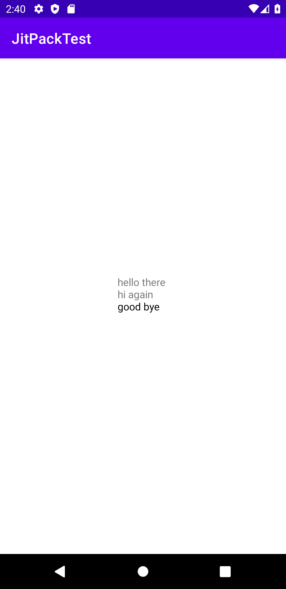

# LogCatCollector
Library to collect logcat output.
In certain scenarios it is handy to present logcat output directly in the app for troubleshooting purposes. 
Instead of implementing some particular code for that, I directly grab stuff from the logcat and show it in a TextView.

Uses:

- __[Timber](https://github.com/JakeWharton/timber)__ - A logger with a small, extensible API which provides utility on top of Android's normal Log class.

Initialize Timber in the application onCreate.

```kotlin
package dev.applearrow.jitpacktest

import android.app.Application
import timber.log.Timber

class JitpackApplication : Application() {
    override fun onCreate() {
        super.onCreate()
        Timber.plant(Timber.DebugTree())
    }
}
```


Add your application class into AndroidManifest.xml
```xml
<?xml version="1.0" encoding="utf-8"?>
<manifest xmlns:android="http://schemas.android.com/apk/res/android"
    package="dev.applearrow.jitpacktest">

    <application
        android:name="dev.applearrow.jitpacktest.JitpackApplication"
        android:allowBackup="true"
        ...
    </application>

</manifest>
```

Collect logs directly from logcat. The idea is that you can show not only your own logs, but also any other log that appears in the logcat. 
In my case I'm using it to show info from services, logs from libraries, etc.

```kotlin
   override fun onActivityCreated(savedInstanceState: Bundle?) {
        super.onActivityCreated(savedInstanceState)
        viewModel = ViewModelProvider(this).get(MainViewModel::class.java)

        Timber.d(LOG_START)
        Timber.d("hello there")
        Timber.i("hi again")
        Timber.d("good bye")
        binding.message.text =
            LogCatCollector("MainFragment").collect(LOG_START, true, listOf("good"))

    }
```

[](app/doc/images/screenshot1.png)
